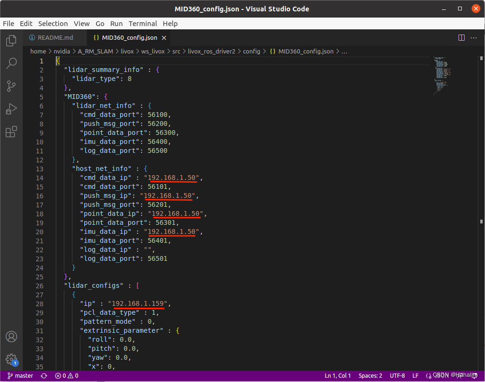
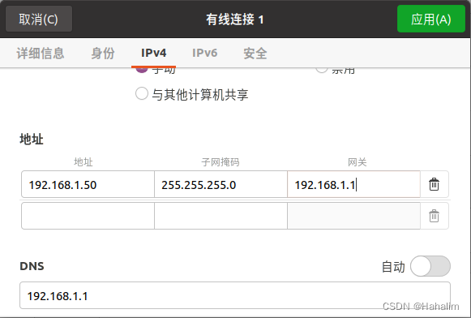

# Livox Mid-360 激光雷达配置
## Livox-SDK2安装编译
[地址] (https://github.com/Livox-SDK/Livox-SDK2)
```bash
git clone https://github.com/Livox-SDK/Livox-SDK2.git
cd ./Livox-SDK2/
mkdir build
cd build
cmake .. && make -j
sudo make install
```
## livox_ros_driver2
[地址] (https://github.com/Livox-SDK/livox_ros_driver2)
```bash
git clone https://github.com/Livox-SDK/livox_ros_driver2.git ws_livox/src/livox_ros_driver2
cd ws_livox
source /opt/ros/noetic/setup.sh
./build.sh ROS1
```
### Livox ros driver 2内部主要参数配置
#### ！下面的ip改为雷达的"ip": 192.168.1.1** 最后两位为雷达S/N码最后两位数字
实验室两个雷达分别是30和48
192.168.1.5还是192.168.1.50 主要是看以太网的ip，要和以太网保持一致
由于自己即使在iPv4中修改，地址仍然默认为192.168.1.50，所以代码设置为50

#### 接下来修改本机以太网ip 
在设置里改有线设置

建议全部照搬

